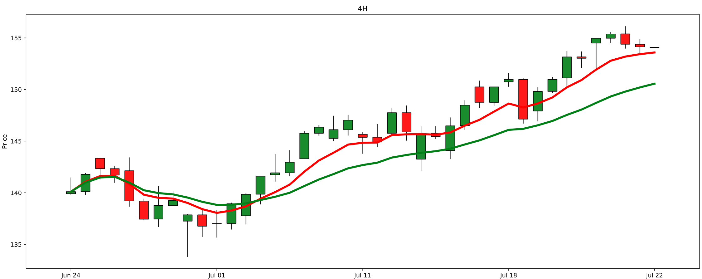
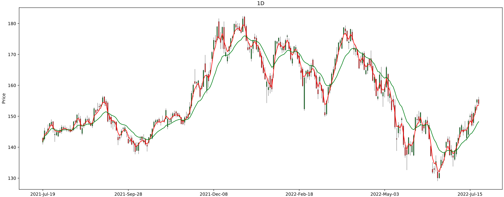
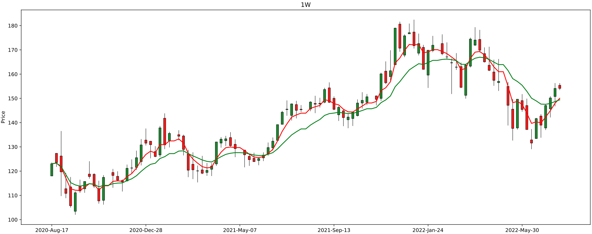
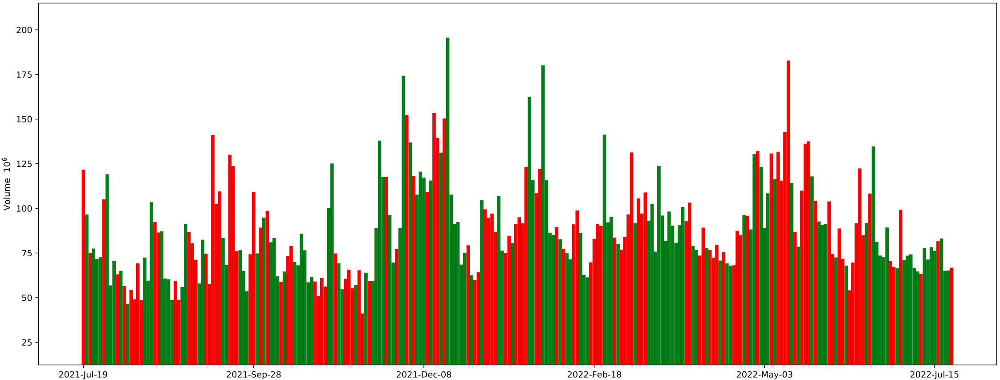

# Supplypipe
Stock price extractor and signal generator using Exponential Moving Averages ([EMA][EMA]) at different timeframes:
 - 4H -> four hours
 - 1D -> one day
 - 1W -> and one week
EMAs can be plotted at different lengths.

By default it implements an EMA multi-timeframe strategy of [crossovers][cross]. The strategy considers a `BUY` signal if the EMA of length 3 at 1D crossed the EMA of length 15 at 1D.

This is done looking at the previous day's EMA 3 and 15 in order to compare. To complete the signal, also EMA of length 5 at 1W needs to be bigger that EMA of length 15 at 1W. The conditions for the `BUY` signal look like this:
 - *EMA(3) at 1D > EMA(15) at 1D*
 - *EMA(5) at 1W > EMA(15) at 1W*

The reserve conditions are true for `SELL` signals:
 - *EMA(3) at 1D < EMA(15) at 1D*
 - *EMA(5) at 1W < EMA(15) at 1W*

The plots use japanese [candlesticks][candle] to draw prices at every time intervals. Each candlestick drawn provides information about 'open', 'close', 'high', and 'low'. Their color represents direction, if it is `green` signifies that price closed higher than it opened, and if `red`, the price ended up lower than the open.

In the plots, the EMAs are plotted as lines. The `red` color coresponds to the smaller length EMAS i.e. EMA (3), EMA(5) for both 1D and 1W. The `green` color corresponds to the larger length EMAs i.e EMA(15) for both 1D and 1W.

[Volume][volume] is also included per day. `Red` color means price closed lower an that day and `green` color means price went up in that candle.

# Stock market data APIs
They offer real-time or historical data on financial assets that are currently being traded in the markets. These APIs usually offer prices of public stocks, ETFs, ETNs.

These data can be used for generating technical indicators which are the foundation to build trading strategies and monitor the market.

# Data

Use of the following APIs and where they can be used:

- Yahoo Finance
- Google Finance in Google Sheets
- IEX Cloud
- AlphaVantage
- World trading data
- Other APIs (Polygon.io, Intrinio, Quandl)

## Yahoo Finance

This is currently used. There’s a new python module ``yfinance`` that wraps the new Yahoo Finance API. To install it:
```bash
pip install yfinance
```
Documentation for the API can be found [here][yahoo-doc].

# Pre-requisites

To succesfully run this repository, you will need:
 - Python >= 3.9
 - Miniconda3/Conda

# Installation

To install it locally:

```bash
git clone https://github.com/danielboloc/Supplypipe.git
cd Supplypipe
conda env create --name <env-name> --file environment.yml
conda activate <env-name>
python setup.py --build
python setup.py --install
```

To pull it form Docker Hub [here][docker-hub]:
```bash
docker pull dboloc/supplypipe:v1.0.0
```

To build the image locally:
```bash
cd Supplypipe
export DOCKER_BUILDKIT=1
docker build -t supplypipe:v1.0.0 .
```
# How to run

## Command line options

All parameters can be seen with:
```
$> python SupplyPipe.py --help

Usage: Supplypipe.py [OPTIONS]

Options:
  --only-stock      To only look at the 'stocks' section in config
  --on-demand TEXT  You can put the ticker symbol, e.g MSFT or multiple 'MSFT,
                    AAPL'
  --intervals TEXT  Three intervals for multi-timeframe analysis
  --start TEXT      Start date of data retrieval. The analysis will be
                    performed in this interval also
  --end TEXT        End date of data retrieval
  --help            Show this message and exit.
```

Using `--on-demand` will not take into account the strategy/ies logic although it will plot all components. This parameter is just to see the price action of the stock/s.

Using `--only-stock` parameter will only consider the securities in the `stocks` section under `SECTORS` in `config/default.conf`.

Time intervals can be specified for the data download. By default is '60m 1d 1wk'. This will download resampled data in the case of one day and week, but for 4H we will have to resample.

You can specify the `--start` and `--end` which will limit the days to download the data i.e. could be `2022-07-01` to `2022-07-22`, and the plots will only this time window. The max days to display is 729.

## Configuration file

There is a `SECTORS` section in `config/default.conf` which displays all sectors and has one stock/ETF as defalut. New sectors and known stocks separated by comma in their respective sector.

## Run tests

```bash
cd Supplypipe
python -m unittest discover
```
And the tests through Docker:
```bash
docker run \
    --rm \
    --entrypoint /bin/bash dboloc/supplypipe:v1.0.0 \
    -c "python -m unittest discover"
```

## Run examples

Use `AAPL` on demand.

Locally:
```
python Supplypipe.py --on-demand AAPL
```

Docker:
```bash
docker run \
    --mount "type=bind,source=$(pwd)/analysis,destination=/supplypipe/analysis"\
    dboloc/supplypipe:v1.0.0 --on-demand AAPL
```

Run in for all securities in the `[SECTORS][stocks]` config.

Locally:
```
python Supplypipe.py --only-stock
```

Docker:
```bash
docker run \
    --mount "type=bind,source=$(pwd)/analysis,destination=/supplypipe/analysis"\
    dboloc/supplypipe:v1.0.0 --only-stock
```

Run in for all sectors in `[SECTORS]` config.

Locally:
```
python Supplypipe.py
```

Docker:
```bash
docker run \
    --mount "type=bind,source=$(pwd)/analysis,destination=/supplypipe/analysis"\
    dboloc/supplypipe:v1.0.0
```

# Results

Running this package you will get one or multiple plots depending on the arguments passed. The next sections are generated for `AAPL`:

- **first section**: 4H timeframe with EMA(3) and EMA(15) at 4H. The candles are very clear and the EMA crossover is also clear (`red` line is above `green`).

- **second section**: 1D timeframe with EMA(3) and EMA(15) at 1D. The candles are more abundant, but the time window is bigger.

- **thirs section**: 1W timeframe with EMA(5) and EMA(15) at 1W. The candles are very clear, with the same time window as 1D.

- **fourth section**: volume bars for 1D timeframe.


# Disclaimer

The information contained herein is not intended to be a source of advice or investment analysis with respect to the material presented, and the information and/or code, documents contained in this repository DO NOT constitute investment advice. The ideas and strategies should never be used without first assessing your own personal and financial situation, or without consulting a financial professional. This code is intended to be used and must be used for informational purposes only. I'm not a broker/dealer nor an investment advisor.

[yahoo-doc]: https://github.com/ranaroussi/yfinance
[docker-hub]: https://hub.docker.com/repository/docker/dboloc/supplypipe
[EMA]: https://www.investopedia.com/terms/e/ema.asp
[candle]: https://www.investopedia.com/terms/c/candlestick.asp
[cross]: https://www.investopedia.com/articles/active-trading/052014/how-use-moving-average-buy-stocks.asp
[volume]: https://www.investopedia.com/terms/v/volume.asp
